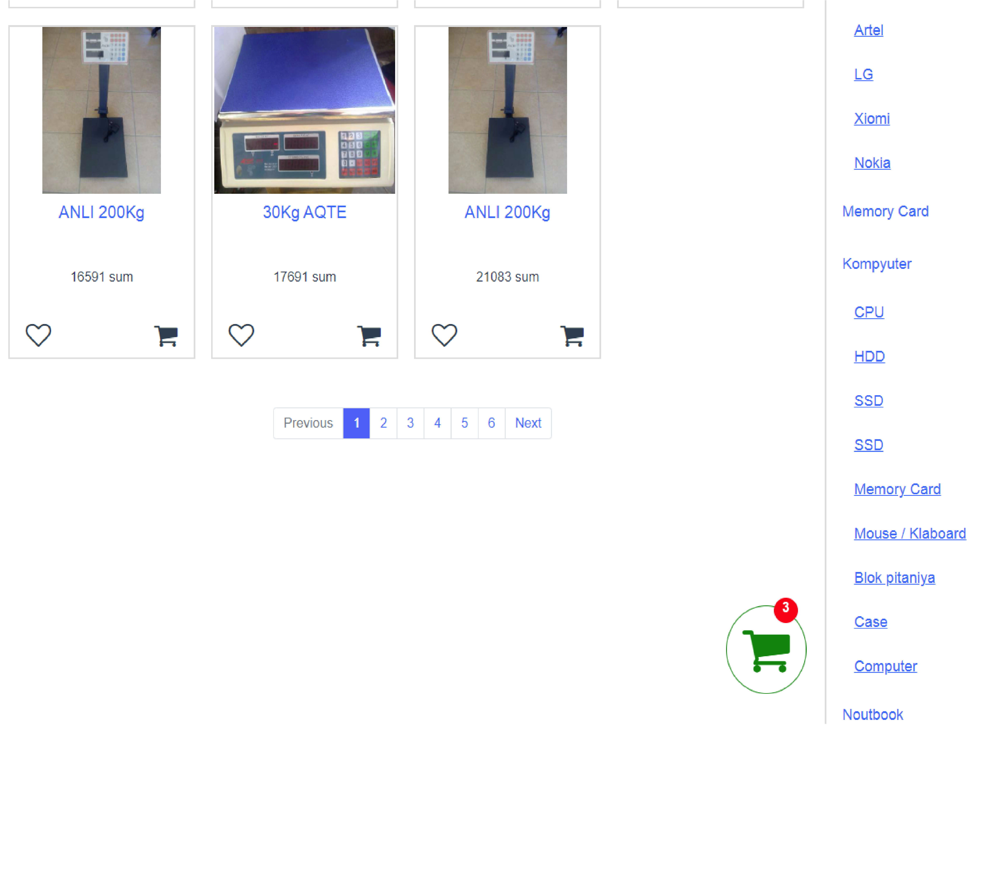

# Portfolio vue-3 laravel 8 online store

### Ajax Axios lib
### ajax search product
### ajax pagination
### vuex 
### ajax sort product price ( low and top )
### minicart
### feedback
### about view
### localstorage ( add product to cart )
### Backend Laravel 8
### Api
### Laravel Request, Resource, model, controller, migrate, factory, seeder,  and other ...

```

````

```
  ### Site
```


```
  ### About page
```


```
  ### Feedback page
```


```
  ### Orders page
```


```
  ### Product page
```


```
  ### Product sort low and top price
```


```
  ### Pagination product with ajax
```




```
  ### Ajax sort product
```


```
  ### Add product to cart and show minicart
```


## Project setup
```
npm install
```

### Compiles and hot-reloads for development
```
npm run serve
```

### Compiles and minifies for production
```
npm run build
```

### Customize configuration
See [Configuration Reference](https://cli.vuejs.org/config/).
